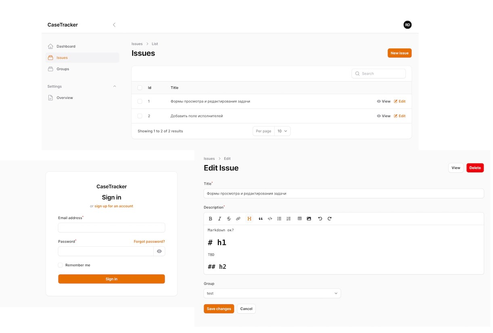

# CaseTracker
Task Tracking and Project Managment, BPM, ACM
https://github.com/aiiddqd/casetracker

# Core Concepts
- inspired by GitHub Issues Tracker, Notion Tables, Jira and FreeScout
- Use Adaptive Case Managment as key ideas
- Plartform - Filament and TALL-stack
- Modular and event driven architecture
- Open Source

https://github.com/aiiddqd/casetracker

# Plugins and events
- Eventy https://github.com/tormjens/eventy
- Example https://github.com/freescout-helpdesk/freescout/

# Docs
- Filament PHP https://filamentphp.com/docs
